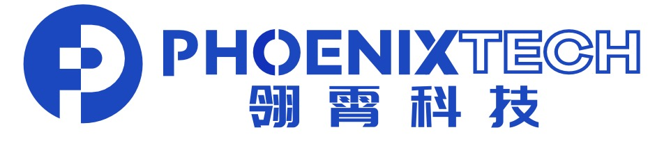

# 📖 Educations
- *2024.09 - Now*    , Direct doctoral student, Fudan University, Shanghai.
- *2020.09 - 2024.06*, Undergraduate,China University of Geosciences Beijing (CUGB), Beijing.
- *2017.09 - 2020.06*, Xinzhou No.1 Middle School, Xinzhou.

# 💻 Internships
- *2021.06 - 2023.09*,[Beijing BoChuang-Tech Co.,Ltd, Beijing.](https://www.bbcpetro.com/)
 
#   Startups
- *2023.11 - 2024.03*,Beijing Feiyi Lingxiao Information Technology Co., Ltd., Founder.
- *2024.04 - 2024.11*,Ningbo Phoenixtech Technology Co.,Ltd, Founder.
## Our Fundings
#### Xbotpark Seed-stage Exploration Fund
- **Funding:** $500,000  
- **Institutional Investor:** Xbotpark  
- **Role:** Project Leader & Product Manager  
- **Year:** 2024  
---
#### Innovation and Entrepreneurship Fund for College Students (2024–2026)
- **Funding:** $50,000  
- **Sponsor:** China University of Geosciences, Beijing  
- **Role:** Project Leader & Product Manager  
---
#### Innovation and Entrepreneurship Fund for College Students (2022–2023)
- **Funding:** $10,000  
- **Sponsor:** China University of Geosciences, Beijing  
- **Role:** Project Leader & Product Manager  

